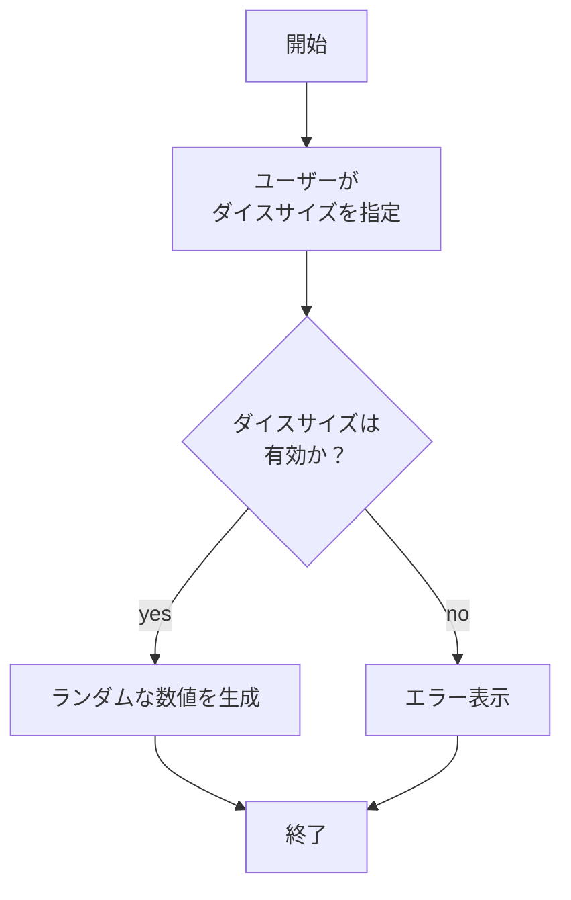
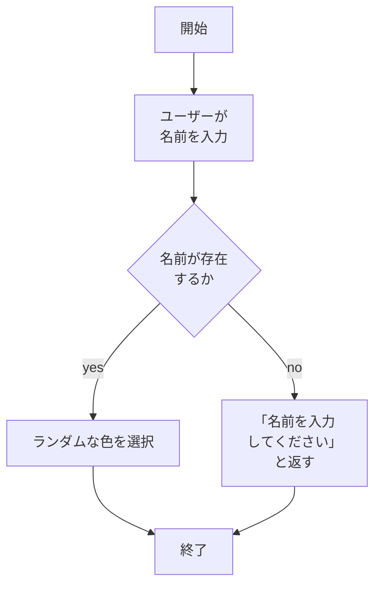

# webpro_06

## ファイル一覧
ファイル名 | 説明
-|-
app5.js | プログラム本体
public/roll-dice.html | ダイスが振れる
public/color.html | 名前に沿ったイメージカラーが決定される
public/roll-dice.ejs | ダイス結果
public/color.ejs | イメージカラー表示


##　1.ダイスを振ろう
```　ゲームでよく使うダイスを同じサイトで振れるようにした．ユーザーが選択したサイコロのサイズ（3, 4, 6, 8, 10, 12, 20, 100面）に応じて結果を表示する． ```



### 実装手順
1. app5.js を起動する
1. Webブラウザでlocalhost:8080/public/roll-dice.htmlにアクセスする
1. 振りたいダイスを選ぶ

##　2.イメージカラーを決めよう
```作ったキャラクターのイメージカラーがざっくりランダムで決められるようにした.名前を入力すると、その人にランダムなイメージカラーを表示する。```


### 実装手順
1. app5.js を起動する
1. Webブラウザでlocalhost:8080/public/color.htmlにアクセスする
1. イメージカラーを決めたい名前を入力する．